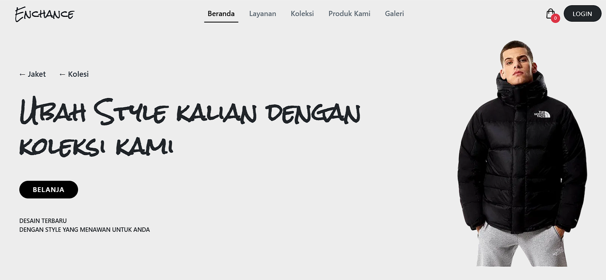
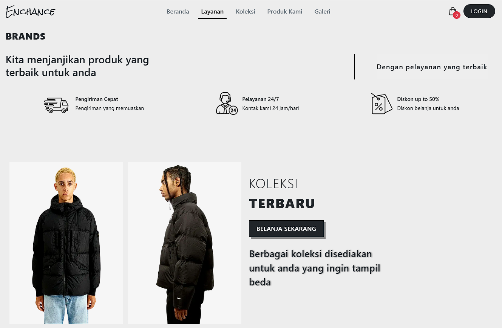

# Enchance Shop - Website E-commerce  

**Enchance Shop** adalah sebuah website e-commerce modern dan stylish yang berfokus pada penjualan pakaian trendy, seperti jaket, kemeja, dan hoodie. Platform ini dirancang untuk memberikan pengalaman belanja yang mudah dengan navigasi responsif, desain menarik, dan fitur e-commerce yang lengkap.  

---

## 🔗 **Demo Langsung**  
[Kunjungi Enchance Shop](https://oracle4me.github.io/enchance-shop/)  

---

## 🛠️ **Teknologi yang Digunakan**  
- **HTML**: Untuk struktur dan tata letak.  
- **CSS**: Untuk desain dan responsivitas.  
- **JavaScript**: Untuk interaktivitas dan konten dinamis.  

---

## 🌟 **Fitur Utama**  
1. **Koleksi Pakaian Trendy**:  
   - Menyediakan berbagai pilihan jaket, kemeja, dan hoodie dengan desain modern.  

2. **Navigasi Single-Page**:  
   - Transisi yang halus antar bagian seperti Beranda, Koleksi, Layanan, dan Keranjang.  

3. **Desain Berpusat pada Pengguna**:  
   - Termasuk modals untuk menambahkan produk ke keranjang atau langsung membeli.  

4. **Responsif untuk Mobile**:  
   - Dioptimalkan untuk berbagai ukuran layar.  

5. **Bagian Produk Interaktif**:  
   - Menyoroti penjual terbaik dan koleksi unggulan.  

---

## 🖼️ **Tampilan**  

### Tampilan Desktop  
  

### Tampilan Mobile  
  

---

## 🚀 **Cara Menggunakan**  
1. Clone repository ini:  
   ```bash  
   git clone https://github.com/username-anda/enchance-shop.git
